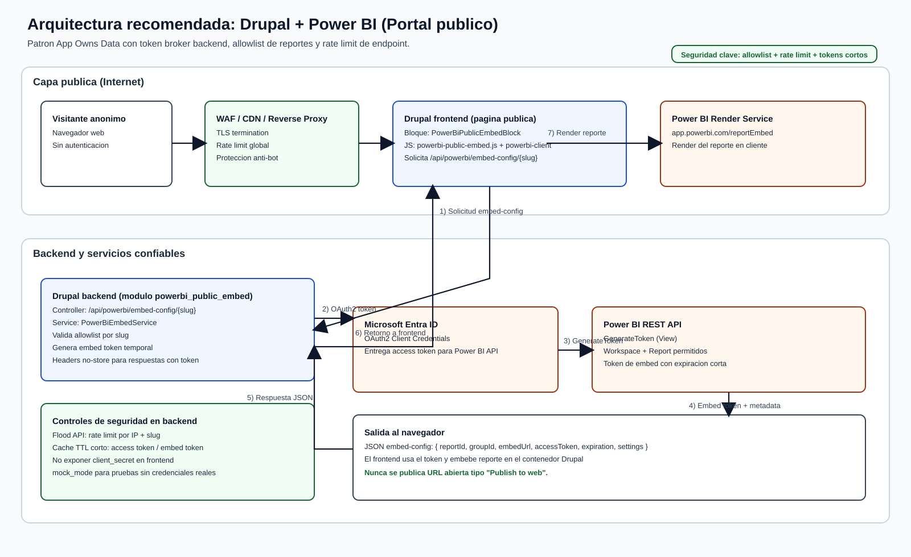

# Implementación de referencia: Power BI público seguro en Drupal

## 1) Objetivo

Implementar en Drupal un mecanismo para embeber reportes de Power BI en un portal público (sin login de usuario final), minimizando riesgos de seguridad mediante:

- Token de embed temporal generado en backend.
- Allowlist de reportes permitidos por `slug`.
- Rate limit del endpoint de tokens.
- Modo demo (`mock_mode`) para pruebas sin credenciales reales.

> **Importante:** esta solución evita `Publish to web` y usa el patrón recomendado `App owns data`.

---

## Arquitectura visual



---

## 2) Qué se implementó en este repositorio

Se creó el módulo custom:

`web/modules/custom/powerbi_public_embed`

### Archivos principales

- `powerbi_public_embed.info.yml`  
  Define el módulo Drupal.
- `powerbi_public_embed.routing.yml`  
  Expone:
  - `/api/powerbi/embed-config/{slug}` (público)
  - `/admin/config/services/powerbi-public-embed` (configuración)
- `src/Service/PowerBiEmbedService.php`  
  Lógica de negocio:
  - lectura de allowlist
  - generación de access token (Entra ID)
  - generación de embed token (Power BI API)
  - caché segura y modo mock
- `src/Controller/EmbedConfigController.php`  
  Endpoint JSON con rate limit por IP+slug.
- `src/Form/PowerBiPublicEmbedSettingsForm.php`  
  Formulario administrativo para credenciales y parámetros.
- `src/Plugin/Block/PowerBiPublicEmbedBlock.php`  
  Bloque para insertar el contenedor de un reporte por slug.
- `js/powerbi-public-embed.js`  
  Frontend para:
  - pedir embed config al endpoint
  - embeber usando `powerbi-client`
  - fallback visual en `mock_mode`
- `config/install/powerbi_public_embed.settings.yml`  
  Configuración de ejemplo.

---

## 3) Flujo técnico

1. Un visitante abre una página pública de Drupal con el bloque de reporte.
2. El JS del bloque solicita `GET /api/powerbi/embed-config/{slug}`.
3. Drupal aplica rate limit.
4. Drupal valida que el `slug` exista en la allowlist.
5. Si `mock_mode=true`, responde token simulado (demo).
6. Si `mock_mode=false`:
   - Drupal solicita access token a Entra ID (client credentials).
   - Drupal solicita embed token a Power BI API.
   - Drupal responde JSON con `embedUrl`, `reportId`, `accessToken`.
7. El navegador embebe el reporte con `powerbi-client`.

---

## 4) Cómo probar rápido con datos de ejemplo

### 4.1 Activar módulo

```bash
drush en powerbi_public_embed -y
drush cr
```

### 4.2 Configurar bloque

1. Ir a **Estructura > Bloques**.
2. Agregar bloque **Power BI public embed** en la región deseada.
3. Definir `report_slug` con un slug existente en la allowlist, por ejemplo:
   - `economia-nacional`

### 4.3 Verificar endpoint demo

Con `mock_mode=true` (valor por defecto), el endpoint responde sin llamar a APIs externas:

```bash
curl -s "https://TU-DOMINIO/api/powerbi/embed-config/economia-nacional"
```

Respuesta esperada (ejemplo):

```json
{
  "slug": "economia-nacional",
  "reportId": "bbbbbbbb-bbbb-bbbb-bbbb-bbbbbbbbbbbb",
  "groupId": "aaaaaaaa-aaaa-aaaa-aaaa-aaaaaaaaaaaa",
  "embedUrl": "https://app.powerbi.com/reportEmbed?reportId=bbbb...&groupId=aaaa...",
  "accessToken": "mock_...",
  "tokenType": "Embed",
  "expiration": "2026-02-19T00:00:00+00:00",
  "settings": {
    "panes": {
      "filters": { "visible": false, "expanded": false },
      "pageNavigation": { "visible": false }
    },
    "bars": {
      "statusBar": { "visible": false },
      "actionBar": { "visible": false }
    }
  },
  "isMock": true
}
```

---

## 5) Paso a producción

Ir a:

`/admin/config/services/powerbi-public-embed`

y ajustar:

1. `tenant_id`, `client_id`, `client_secret`.
2. `mock_mode = false`.
3. Allowlist de reportes reales (`slug|workspace_id|report_id|dataset_id`).
4. Rate limit según tráfico esperado.
5. Limpiar caché:

```bash
drush cr
```

---

## 6) Checklist mínimo de seguridad

- [ ] **No usar** `Publish to web`.
- [ ] Mantener `client_secret` fuera de repositorio (ideal: variables de entorno o secret manager).
- [ ] Aplicar WAF/CDN en frontal del sitio público.
- [ ] Mantener rate limit activo en endpoint `/api/powerbi/embed-config/*`.
- [ ] Permitir únicamente slugs definidos en allowlist.
- [ ] Deshabilitar opciones de exportación en Power BI tenant/workspace cuando aplique.
- [ ] Revisar logs de errores y patrones de abuso.
- [ ] Configurar CSP para permitir únicamente orígenes necesarios (`app.powerbi.com`, `*.powerbi.com` según caso).

---

## 7) Limitaciones conocidas de este ejemplo

- El frontend carga `powerbi-client` desde CDN (válido para demo; en entornos estrictos conviene empaquetarlo localmente).
- El bloqueo de exportación se limita a UI/ajustes de embed; el control definitivo debe reforzarse en configuración del tenant/workspace Power BI.
- No incluye RLS avanzada (se puede extender en el servicio para token generation con identidades efectivas).

---

## 8) Ruta recomendada de evolución (rápida)

1. Desplegar este módulo como MVP.
2. Monitorear endpoint (latencia, errores, abuso).
3. Mover secretos a gestor seguro.
4. Añadir métricas/auditoría centralizada.
5. Si se requiere, encapsular el frontend en Web Component corporativo manteniendo este backend como token broker.
